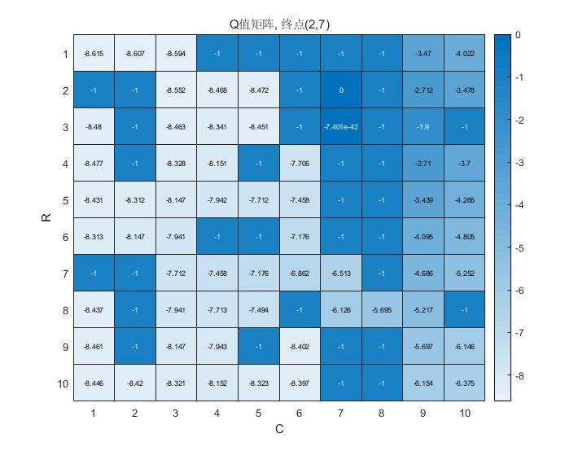
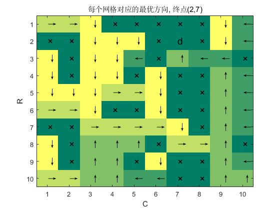
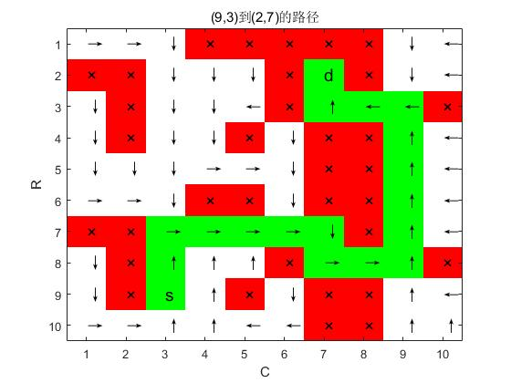
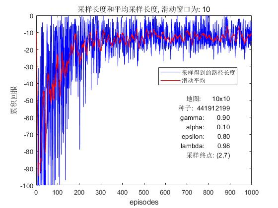

# Q学习的 Matlab 实现
本项目是基于迷宫环境. 与最短路径算法不同, Q学习算法使`agent`能够通过与环境交互(采取四个方向的动作), 计算从给定的起点到**固定的**终点的最短路径. 
## 文件结构
1. `readMaze.m`: 读取迷宫数据, 目前存储为矩阵的形式
2. `q_learning.m`: Q学习的核心算法
3. `plotMaze.m`: 绘制平均路径, 地图和各个点的最佳方向
4. `actions.m`: 定义动作空间
5. `plotQ.m`: 单独保存某一次迭代的Q矩阵图像, 默认保存为目录下的`images`文件夹
6. `main.m`: 执行主要功能
## 说明
如果需要修改起始点, 并绘制相关的路径, 可以在`main.m`运行完`q_learning`函数之后, 修改`start`并运行

```matlab
start = [2,3];
plotMaze(OM, Q, HA, HP, start, dest, seed, gamma, alpha,epsilon,lambda);
```
代码即可绘制其他起点的图像.
## 结果
1. 输出的Q值矩阵(迭代1000次):


2. 各个状态的采取的最优的行为:


3. 最优的路径:


4. 平均的回报:


## 需求
基于 Matlab 2019a 开发. 需要使用部分函数进行绘图:

函数|Matlab版本的最低需求
-|-
heatmap|Matlab 2017a
strings|Matlab 2016b
